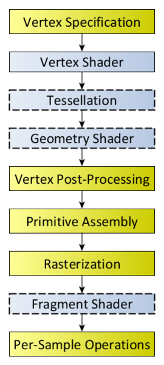
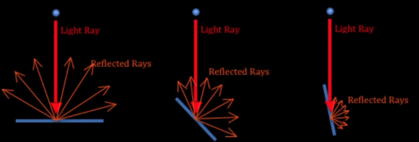

# Computação gráfica e modelo de iluminação Phong

Aqui, irei dar uma breve introdução sobre alguns conceitos de computação gráfica e explicar o modelo de iluminação Phong.

No código apresentado, está o modelo de iluminação Phong implementado, no qual consiste de um fragment shader.

É possível executá-lo em algum playground online, como o [shdr.bkcore.com](https://shdr.bkcore.com/), sendo necessário apenas fazer as alterações necessárias para utilizar das mesmas variáveis do playground, que no caso do site seria só mudar o nome do `v_normal` pra `fNormal`, e mudar o seu `vec4` para um `vec3`.

Ou, você pode utilizar a extensão [glsl-canvas](https://marketplace.visualstudio.com/items?itemName=circledev.glsl-canvas), que quando integrada ao VSCode, lhe dá uma visualização rápida e com hot reload do shader a ser modificado. Essa foi a opção que utilizei, por conta da facilidade em modificar e visualizar o código.

## Representação do espaço 3D

Todo o objeto 3D é formado por vértices, que são representados por vetores de três dimensões (x, y, z), esses vértices são conectados para formar arestas e faces, que geralmente são triângulos, para formar malhas (meshs). Essas meshs definem a superfície do objeto.

Há alguns sistemas de coordenadas diferentes, que ajudam a organizar a cena, calcular a visualização e aplicar transformações:
- Coordenadas do objeto (Model Space): Cada objeto começa em seu próprio espaço de referência, onde os vértices estão definidos em relação à origem do objeto.
- Coordenadas do mundo (World Space): Os objetos são posicionados no espaço global da cena.
- Coordenadas da câmera (View Space): Uma transformação posiciona os objetos em relação à câmera, considerando o ponto de vista do observador.
- Coordenadas da tela (Screen Space): Os vértices são projetados no plano 2D da tela, usando projeção ortográfica ou perspectiva.

## Render pipeline

<center>
    
    <p>Referência: <a href="https://www.khronos.org/opengl/wiki/File:RenderingPipeline.png">https://www.khronos.org/opengl/wiki/File:RenderingPipeline.png</a></p>
</center>

## Shaders

Shaders são pedaços de código que são executados pela GPU e são utilizados para controlar como al uz, cor e outros aspectos visuais são aplicados aos objetos de uma cena 3D.

Há dois tipos principais de shader:
- Vertex shader: processa cada vértice do objeto e manipula informações como posição, normais e texturas dos vértices.
- Fragment shader: processa cada fragmento gerado pelo rasterizador após o vertex shader, calcula a cor final do pixel, aplicando efeitos de iluminação, transparência e muitos outros.

Uma das linguagens mais utilizadas para escrever shaders, é o GLSL (OpenGL Shading Language), que é utilizada no contexto do OpenGL, que é uma API usada para renderização gráfica e que é executada na GPU. É uma linguagem similar ao C, paralela, com suporte nativo à vetores e matrizes, e fortemente tipada.

## Iluminação Phong

Há diversos modelos de iluminação, dos mais simples ao mais avançados, que servem à diversos propósitos. O que irei apresentar, é o Phong, um dos mais básicos, e que utiliza de três componentes para definir como a luz irá interagir, ambient (ambiente), diffuse (difusa) e specular (especular).

### 1. Ambiente

É uma forma de reflexão da luz mais sútil, que representa a luz na qual foi dispersada e refletida tantas vezes, que a sua direção original se tornou impossível de determinar. Um exemplo de caso de uso é em locais com luz bem amena, como quando há apenas a luz da lua em um lugar.

Simula um efeito de luz indireta do mundo real, é útil pois sem ela, áreas que não recebem luz apareceriam completamente pretas, o que raramente acontece no mundo real devido à reflexões múltiplas da luz em superfícies.

Seu cálculo se dá de maneira simples, implementado em GLSL na forma de uma função ficaria assim:

```glsl
vec3 calcularAmbiente(vec3 corAmbiente, vec3 corMaterial, float intensidadeAmbiente) {
    return corAmbiente * corMaterial * intensidadeAmbiente;
}
```

Onde:
- corAmbiente: cor da luz ambiente, que geralmente é branca
- corMaterial: cor do material do objeto
- intensidadeAmbiente: valor entre 0 e 1 que controla a força da iluminação ambiente

Essa iluminação é constante em toda a superfície, não depende da posição ou orientação do objeto, não considera a direção da luz ou a normal da superfície, e é muito simples e barata em questões de performance, por ser apenas uma multiplicação simples de cores.

Por ser um tipo de iluminação bem simples e irrealista em muitos casos, é usada apenas de maneira complementar no Phong, geralmente com uma intensidade entre 0.1 a 0.3, somando com as outras componentes.

### 2. Difusa

A iluminação difusa representa a luz que atinge uma superfície e é refletida igualmente em todas as direções.

<center>
    
</center>

Ela é importante para criar a percepção de volume em objetos 3d e criar sombras suaves e graduais nas superfícies.

Seu cálculo utiliza o produto escalar entre o vetor normal da superfície e o vetor de direção da luz:

```glsl
vec3 calcularDiffuse(vec3 normal, vec3 direcaoLuz, vec3 corLuz, vec3 corMaterial) {
    // Normalizar os vetores para obter o cosseno do ângulo no produto interno
    vec3 normalNormalizada = normalize(normal);
    vec3 direcaoLuzNormalizada = normalize(direcaoLuz);
    
    // Calcular o cosseno do ângulo entre os vetores
    float cosseno = max(dot(normalNormalizada, direcaoLuzNormalizada), 0.0);
    
    // Calcular a componente difusa
    return corLuz * corMaterial * cosseno;
}
```

Então, por meio dessa componente, temos que quando a luz está perpendicular à normal (0º), a iluminação está em sua intensidade máxima, quando está a 90º, está sem iluminação, e ângulos negativos são tratados como 0 por conta da função ``max()``, que tem como segundo argumento, o 0.

### 3. Especular

A iluminação especular simula reflexões concentradas da luz em superfícies brilhantes, criando os "pontos de brilho" que vemos em objetos polidos. Diferentemente da iluminação difusa, a especular depende não só da direção da luz, mas também da posição do observador, criando reflexos que se movem conforme mudamos nosso ponto de vista.

Ela é importante para diferenciar materiais brilhantes de materiais foscos, criar sensações de superfícies polidas ou molhadas, adicionar detalhes realistas a metais e plásticos e dar dicas visuais sobre a curvatuar da superfície.

Na sua implementação matemática, temos o brilho, que é um valor tipicamente de 1 a 256 que controla o tamanho do reflexo especular, e temos principalmente 3 vetores, o vetor de reflexão da luz (R), o vetor de visão ou direção do observador (V), e o vetor normal da superfície (N):

```glsl
vec3 calcularSpecular(vec3 normal, vec3 direcaoLuz, vec3 direcaoVisao, vec3 corLuz, vec3 corEspecular, float brilho) {
    // Normalizar vetores
    vec3 N = normalize(normal);
    vec3 L = normalize(direcaoLuz);
    
    // Calcular vetor de reflexão
    vec3 R = reflect(-L, N);
    
    // Calcular vetor de visão normalizado
    vec3 V = normalize(direcaoVisao);
    
    // Calcular componente especular
    float spec = pow(max(dot(R, V), 0.0), brilho);
    
    return corLuz * corEspecular * spec;
}
```

### Visão geral do Phong

Somando essas três componentes, nós temos o modelo de iluminação Phong, com o ambiente fornecendo uma iluminação base e evitando áreas completamente escuras, o difusa criando uma percepção de volume e de luz gradual por todo o objeto, e a de specular adicionando brilho e reflexo ao objeto, variando também com a posição do observador.

<center>
    
    <p>Referência: <a href="https://commons.wikimedia.org/wiki/File:Phong_components_version_4.png">https://commons.wikimedia.org/wiki/File:Phong_components_version_4.png</a></p>
</center>
